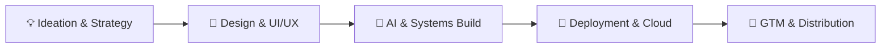

# Mayank Gulati

  

  <b>Building intelligent AI systems, GTM engines, and digital products from ideation to distribution.</b>

  
  
  
  
  
  

---

## ⚡ What I am Building & Up To

I operate at the intersection of AI engineering, Go-To-Market (GTM) systems, and visual storytelling. Here is what is active right now:

- 🏢 [**Daily Needs Association (DNA)**](https://dailyneedsassociation.com): My AI systems studio and automation agency. We architect custom autonomous agents, LLM-powered backends, and full-funnel growth infrastructure for high-velocity brands and operators.
- 🚀 [**Rank Me Higher**](https://rankmehigher.online): My search visibility and Generative Engine Optimization (GEO / AEO) SaaS property. Built to diagnose and optimize how modern brands and e-commerce stores get cited and ranked inside AI answer engines (ChatGPT, Perplexity, Claude, Gemini) and search.
- 🎯 **GTM Engineering & Growth Infrastructure**: Building programmatic acquisition engines, automated lead intelligence pipelines, signal-based outbound workflows, and conversion loops that connect engineering rigor directly to pipeline and revenue.
- 🤖 **Autonomous AI Agents & Workflows**: Designing multi-agent memory architectures, task state machines, semantic retrieval pipelines, and human-in-the-loop agent swarms that run mission-critical workflows with zero manual overhead.
- 🎬 **Filmmaking & Creative Direction**: Directing visual narratives, brand cinema, and high-production educational video. Exploring the blend of cinematic lighting, analog-collage visual systems, and narrative rhythm.
- 💡 **Micro-SaaS & Digital Products**: Taking validated market bottlenecks and shipping lean, high-utility software tools from first spark to live domain.

---

## 🛠️ End-to-End Craft: Ideation to GTM & Scale

I do not just write code or assemble prompt chains. I take ideas through the complete lifecycle:

1. **Ideation & Strategy**: Identifying asymmetric market problems, user psychology, competitive positioning, and unit-economic viability before writing a single line.
2. **Product Design & Brand UI/UX**: Crafting bespoke design systems, high-fidelity Figma prototypes, typographic structure, and frictionless interactive experiences.
3. **AI Architecture & Engineering**: Developing robust multi-agent swarms, custom tool bindings, RAG pipelines with vector stores (ChromaDB), and resilient Python/TypeScript microservices.
4. **Deployment & Scaling**: Containerizing services with Docker, instrumenting DVC and MLflow for pipeline rigor, managing edge networks on Cloudflare Pages and Workers, and running automated CI/CD via GitHub Actions.
5. **GTM & Programmatic Distribution**: Engineering the go-to-market motion with automated distribution engines, GEO/AEO optimization, programmatic SEO, and data-driven conversion loops.

---

## 🔥 Tech Stack & Tooling

  

  
  
  
  
  
  
  
  
  
  
  
  

---

## 🎬 Featured Repositories & Engineering Builds

| System | Architecture & Capabilities | Stack |
|---|---|---|
| 🎌 [**Anime Recommender System (LLMOps)**](https://github.com/Basswala/ANIME-RECOMMENDER-SYSTEM-LLMOPS) | Production LLMOps engine with vector search, semantic embeddings, Groq API, and Kubernetes manifests. | LangChain, ChromaDB, Groq, Docker, K8s, Streamlit |
| 🔄 [**Modern MLOps Pipeline**](https://github.com/Basswala/modern-mlops-pipeline) | End-to-end reproducible machine learning pipeline with automated DVC versioning, MLflow tracking, and FastAPI serving. | DVC, MLflow, FastAPI, Docker, GitHub Actions |
| 📊 [**Customer Churn Prediction**](https://github.com/Basswala/Customer-Churn-Prediction) | Production ML pipeline comparing XGBoost/LightGBM/RF models with automated data validation and dual interfaces. | MLflow, Great Expectations, FastAPI, Gradio |
| 🎵 [**Spotify Mood Recommender**](https://github.com/Basswala/Spotify-Mood-Recommender) | Unsupervised clustering of audio features (KMeans, PCA, UMAP) with real-time interactive search. | Python, Scikit-learn, Streamlit, Plotly |

---

## 📚 Principles & Influences

- *"Play long-term games with long-term people. The only way to truly learn anything is by doing."* (Naval Ravikant)
- *"Clarity of thought is the real edge. Master the fundamentals before chasing more tools."*

---

## 📫 Let us Connect

I am always interested in discussing:
- AI Agents, Multi-Agent Coordination, and LLMOps
- GTM Engineering, Autonomous Growth Engines, and GEO/AEO
- Creative Direction, Filmmaking, and Digital Product Design

Connect on [LinkedIn](https://www.linkedin.com/in/mayank-gulati1993/), follow on [X (@mayankgulati99)](https://x.com/mayankgulati99) and [Instagram (@basswala)](https://www.instagram.com/basswala/), or reach out directly at **mayank.gulati99@gmail.com**.
